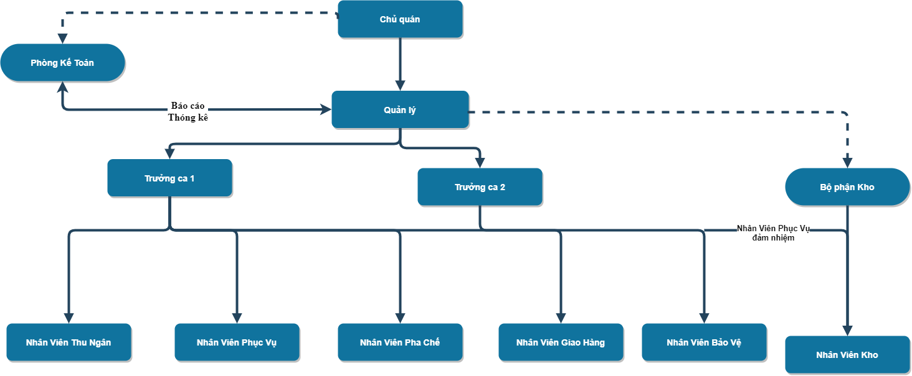
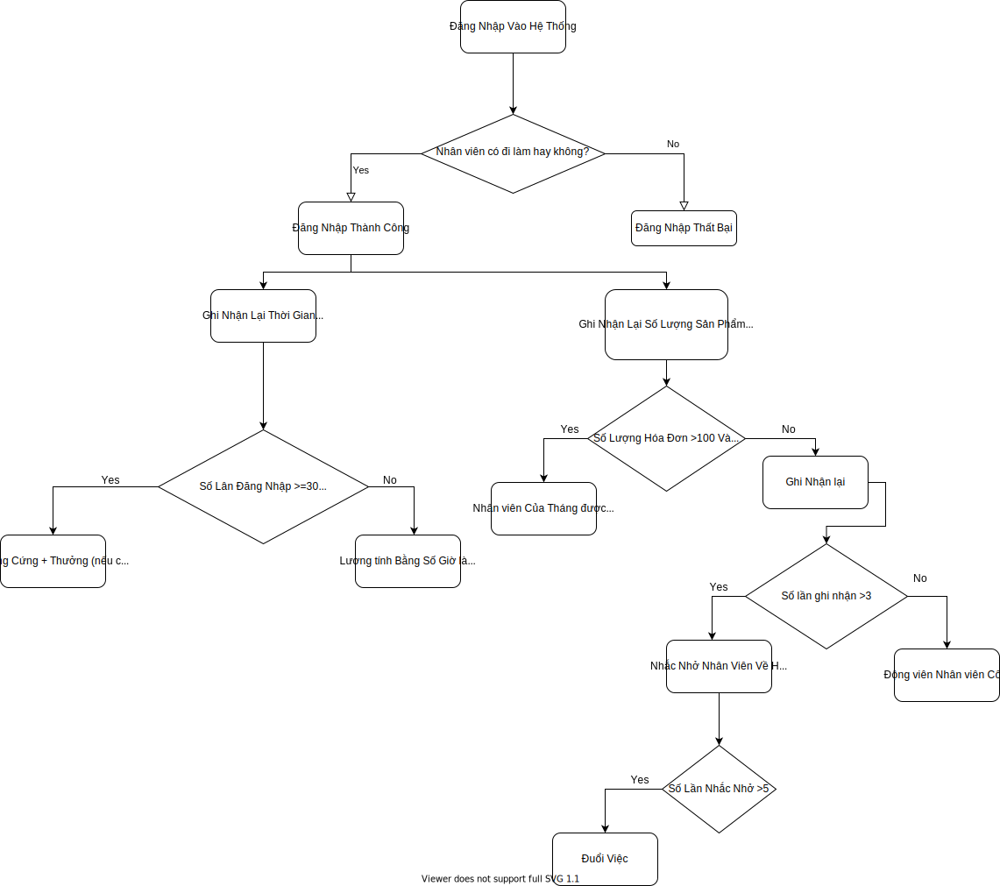

# Nắng Cafe: Tài liệu đặc tả yêu cầu phần mềm - Software Requirement Specification (SRS)

## Giới thiệu dự án - Introduction

### Mục đích - Purpose

Phần mềm này sẽ giúp Nắng Cafe - một cửa hàng cà phê và bánh ngọt cỡ vừa - quản lý quy trình hoạt động và dữ liệu của cửa hàng, cũng như giúp cửa hàng phát triển website giúp tiếp cận, tương tác với khách hàng.

### Những bên sử dụng tài liệu - Intended Audience

- Giảng viên môn học - TS. Nguyễn Thành Huy
- Tất cả sinh viên trong nhóm phát triển phần mềm của Nắng Cafe
  - Nguyễn Triều Minh Khang
  - Noor-A Kim Lam
  - Lương Vĩ Lâm
  - Đỗ Thị Linh
  - Trần Ngọc Tuyết Linh
  - Nguyễn Bá Phi Nhật
  - Nguyễn Phạm Minh Quân
  - Phạm Minh Quang
  - Nguyễn Công Tài

### Phạm vi dự án - Scope

Để Nắng Cafe có thể phát triển nhanh chóng, phần mềm này sẽ giúp ghi chép, lưu trữ và truyền thông tin, dữ liệu, tăng khả năng giao tiếp giữa các ban/thành viên trong cửa hàng. Ngoài ra phần mềm này cũng sẽ bao gồm website của cửa hàng, giúp khách hàng có thể tiếp cận được cửa hàng dễ dàng hơn. Từ những điều trên, phần mềm sẽ giúp cửa hàng hoạt động có tổ chức, có hệ thống hơn.

### Khái niệm và từ biết tắt

...

## Sơ đồ cơ cấu

1. Các chức vụ bao gồm:
   - Chủ quán
   - Kế toán
   - Quản lý
   - Trưởng ca 1 (ca sáng)
   - Trưởng ca 2 (ca chiều)
   - Nhân viên kho (Phục vụ đảm nhận)
   - Nhân viên thu ngân
   - Nhân viên pha chế
   - Nhân viên giao hàng
   - Nhân viên Bảo vệ
2. Sơ đồ cơ cấu phân quyền (Hierarchical organizational structure)
   
   [^1] : Nắng cà phê là mô hình quán coffee vừa

## Nghiệp vụ - yêu cầu

### Nhân viên bán hàng

#### Yêu cầu của nhân viên bán hàng

- **Chấm công:** Nhân viên thực hiện thao tác trên máy POS để máy lưu lại thời gian bắt đầu và kết thúc ca làm
- **Lập hóa đơn:** Lập ra danh sách các món mà khách hàng đã chọn, thực hiện sửa xóa khi khách hàng yêu cầu
- **Xuất hóa đơn:** Cho phép nhân viên in hóa đơn khi khách hàng thanh toán xong
- **Hiển thị lương:** Cho phép nhân viên xem lương và giờ làm của mình

#### Nghiệp vụ của nhân viên bán hàng

- Trong cửa hàng luôn có một khoản tiền cố định (vd 500.000), khi nhân viên bắt đầu ca làm thì thực hiện đếm số tiền đó và xác nhận đủ hoặc thiếu để báo lại cho cấp trên
- Nhân viên khởi động máy POS,máy sẽ lưu lại thời gian bắt đầu và kết thúc ca làm khi nhân viên nhập mã của mình và bấm nút START khi vào ca và END khi kết thúc ca
- Khi khách hàng order thì nhân viên bấm trên máy POS những món khách vừa gọi, xác nhận lại xem khách có muốn thêm hoặ hủy món nào không (để thực hiện công việc thêm, xóa sản phẩm)
- Khi đã xác nhận món và nhận tiền thanh toán thì nhân viên tiến hành in hóa đơn đưa cho khách hàng để khách hàng có thể kiểm tra có sai xót gì không. Khi in hóa đơn ra thì không thể đổi món trong hóa đơn hoặc hoàn tiền lại cho khách hàng. Nếu muốn gọi thêm thì nhân viên lập một hóa đơn khác đưa cho khách hàng
- Khi kết thúc ca, nhân viên ca trước giao ca với nhân viên tiếp theo, cả hai lập báo cáo doanh thu ca đó,thực hiện đếm tiền xem có trùng khớp với doanh thu hay không, nếu thiếu tiền thì nhân viên ca trước phải bồi thường lại số tiền thiếu cho cửa hàng

### Quản lý nhân sự

- Nhân viên khi vào làm việc sẽ phải đăng nhập vào hệ thống bằng tài khoản và mật khẩu được cấp thì mới bắt đầu sử dụng được các chức năng trong quyền hạn của mình như là lập hóa đơn,tạo thông tin khách hàng mới và cuối ca làm của mình thì phải đăng xuất ra khỏi hệ thống
- Sau thời gian kết ca , các tài khoản còn đang đăng nhập trên hệ thống sẽ tự động được đăng xuất.Hệ thống sẽ ghi nhận lại thời gian nhân viên đăng nhập và đăng xuất để tính toán thời gian nhân viên đó đi làm một ngày để có thể ghi nhận lại và tính tiền lương cuối tháng
- Ngoài ra hệ thống còn ghi lại số lượng sản phẩm nhân viên bán được trong 1 ca làm để đánh giá hiểu quả làm việc của nhân viên đó.Số lượng sản phẩm trong một đơn hàng càng nhiều và càng nhiều đơn hàng thì nhân viên đó sẽ được thưởng vào cuối tháng với số tiền thưởng bằng 2% doanh thu cả tháng
  

### Quản lý sản phẩm

#### Yêu cầu - Quản lý sản phẩm (Quyền Admin)

- **Hiển thị danh sách và thông tin sản phẩm:** Cho phép người sử dụng nhìn thấy danh sách sản phẩm và thông tin của sản phẩm qua 1 bảng để dễ dàng quản lý.
- **Thêm sản phẩm:** Cho phép thêm 1 sản phẩm thông qua nút **Thêm**. Khi thêm tất cả các ô thông tin phải được điền đầy đủ và thông tin hợp lệ
- **Sửa sản phẩm:** Cho phép sửa 1 sản phẩm đã chọn trên bảng danh sách thông qua nút **Sửa**. Khi sửa tương tự như **Thêm**
- **Xóa sản phẩm:** Cho phép xóa 1 sản phẩm đã chọn trên bảng danh sách thông qua nút **Xóa**
- **Tìm kiếm sản phẩm:** Cho phép người dùng tìm kiếm nhanh 1 sản phẩm nào đó qua textbox **Tìm kiếm** bằng cách gõ mã sản phẩm hoặc tên sản phẩm
- **Quản lý chương trình khuyến mãi:** Cho phép thêm, sửa, xóa sản phẩm khuyến mãi với mức giá và thời gian khuyến mãi được cài đặt
- **In danh sách sản phẩm (Menu):** Cho phép in danh sách sản phẩm ra file .docx hoặc file .xlsx để có thể chỉnh sửa dễ dàng làm menu quán

#### Nghiệp vụ - Quản lý sản phẩm (Quyền Admin)

1. Khi tới giờ làm việc quản trị viên sẽ đăng nhập vào hệ thống bằng tài khoản có quyền Admin và bấm bắt đầu tức chấm công thời gian bắt đầu sẽ tự động được lưu vào hệ thống
   - Admin quản lý danh sách và thông tin sản phẩm qua bảng danh sách hiển thị trên màn hình
   - Khi cửa hàng ra mắt sản phẩm mới với công thức mới Admin sẽ truy cập vào bảng quản lý sản phẩm để thêm sản phẩm mới
   - Khi cửa hàng cần cải tiến một công đã cũ Admin sẽ truy cập vào bảng quản lý sản phẩm để chỉnh sửa sản phẩm
   - Khi cửa hàng dừng cung cấp một loại sản phẩm nào đấy Admin sẽ truy cập vào bảng quản lý sản phẩm để xóa sản phẩm cũ đi
   - Khi cần tìm kiếm một sản phẩm Admin cần truy cập vào bảng quản lý sản phẩm để tìm kiếm kết quả sẽ được hiển thị rút gọn thông qua bảng danh sách
   - Khi cửa hàng tổ chức 1 đợt khuyến mãi Admin sẽ truy cập vào bảng quản lý sản phẩm để cài đặt chương trình khuyến mãi
   - Khi danh sách sản phẩm được thay đổi (thêm, xóa, sửa) Admin sẽ truy cập vào bảng quản lý sản phẩm để in ra hóa đơn mới nhất
2. Kết thúc ca làm việc quản trị viên bấm kết thúc ca thời gian sẽ được lưu vào hệ thống sau đó Admin đăng xuất khỏi hệ thống
